  

  
  
  

## About Me

I'm **Mohammad Kevin Arif Rudianto**, a fullstack developer specializing in Next.js, NestJS, and modern web & mobile technologies. Currently studying at SMK Telkom Malang, I focus on building scalable web applications with clean architecture and solid engineering practices.

My interests center on backend systems, REST API design, and database modeling - building products that solve practical, real-world problems.

## Current Focus

| Area | What I'm Exploring |
|---|---|
| **Backend Development** | Designing scalable REST APIs with NestJS and Express |
| **Frontend Development** | Building responsive interfaces with Next.js and Tailwind CSS |
| **Mobile Development** | Crafting cross-platform apps with Flutter & Dart |
| **Database & ORM** | Data modeling with Prisma ORM, MySQL, and PostgreSQL |
| **DevOps** | Docker, CI/CD pipelines, and cloud deployments |

## Tech Stack

  

## GitHub Statistics

  
  

## Featured Flagship Projects

| Project | Description | Tech Stack |
|---|---|---|
| [**StoreFlow / kasir-pos-fullstack**](https://github.com/MohammadKevin/kasir-pos-fullstack) | Enterprise Fullstack Point of Sale & Retail Inventory Management | NestJS, Next.js, Prisma, MySQL |
| [**Smart Space Booking**](https://github.com/MohammadKevin/smart-space-booking) | Coworking Space & Meeting Room Reservation Platform | NestJS, React, Prisma, CI/CD |
| [**Dompetify**](https://github.com/MohammadKevin/dompetify) | Mobile Personal Finance & Expense Tracker App | Flutter, Dart, Clean Architecture |
| [**LaundryGo**](https://github.com/MohammadKevin/LaundryGo) | Smart Laundry Service & Real-Time Order Tracking Platform | Next.js, NestJS, Tailwind CSS |
| [**LunchFlow**](https://github.com/MohammadKevin/LunchFlow) | School & Office Catering Lunch Ordering System | Next.js, NestJS, Radix UI |
| [**Mindora**](https://github.com/MohammadKevin/Mindora) | AI-Powered Mental Wellness & Emotion Journaling App | Next.js, Google Gemini AI, Framer Motion |

## Contact

- **Portfolio:** [portfolio-mohammadkevin.vercel.app](https://portfolio-mohammadkevin.vercel.app)
- **LinkedIn:** [Mohammad Kevin Arif Rudianto](https://www.linkedin.com/in/mohammad-kevin-arif-rudianto-945733347)
- **Email:** [kvn4.200581@gmail.com](mailto:kvn4.200581@gmail.com)

> "First, solve the problem. Then, write the code."
